# Evidencias

## Instalación

Una vez instalado xampp, laravel y composer confirmar que se encuentran en el PATH

**Laravel**

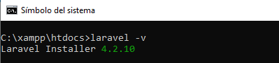

**Composer**

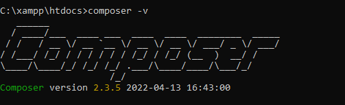

**PHP**

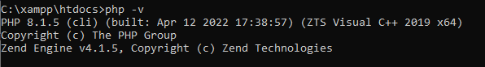

**Creación del proyecto**

Para crear la aplicación se debe escribir en en la ventana de comandos la instrucción **laravel new [nombre de applicacion]**

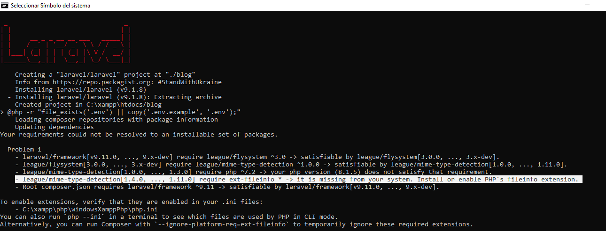

Para corregir este error se debe modificar el archivo php.ini ubicado en la dirección C:\xampp\php\windowsXamppPhp\php.ini. 
Para ver la ubicación puede usar el comando php --ini

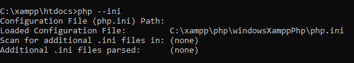

Una vez abiero el archivo debe revisar que la linea extension=fileinfo no esté comentada, no tenga ';'.

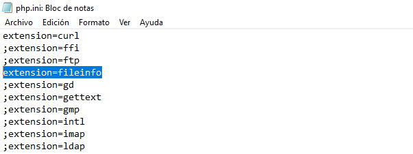

Después de esto deberíamos poder construir nuestra aplicación sin problemas

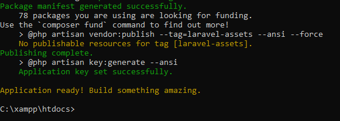

Podemos ver los archivos creados desde el browser, para eso debemos iniciar Apache en xampp

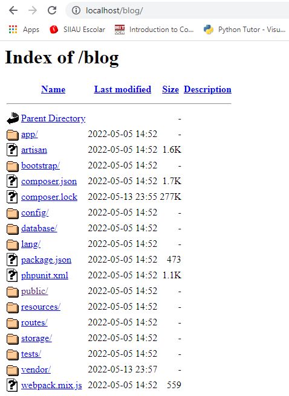

Para ver la aplicación que fue creada accedemos a la carpeta public

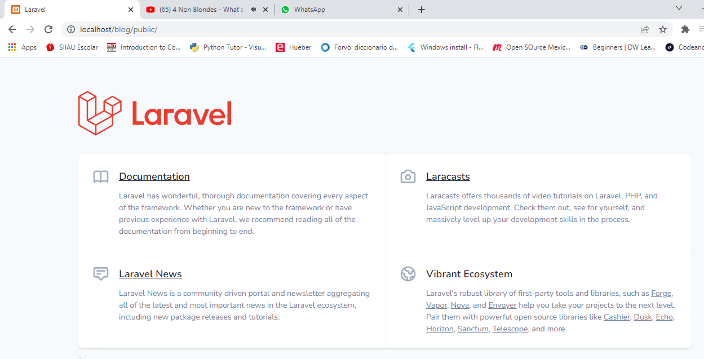

**Creación y manipulación de rutas**

Desde la carpeta routes dentro de nuestra aplicación, podemos encontrar el archivo web.php, en este archivo definiremos las rutas a las que el usuario puede acceder
Las rutas nos permiten mantener partes de nuestra aplicación fuera del alcance de los usuarios y también permiten al usuario navegar por aquellas partes que estén permitidas.

el archivo web.php contiene una ruta que nos dirige a la vista welcome

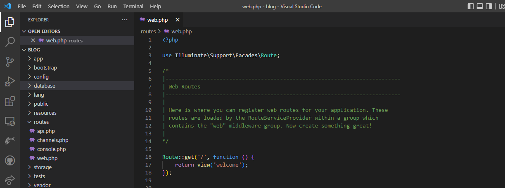

Modifique este archivo para incluir diferentes rutas, para esto cree una función get de la clase Route que acepta como parametros un subdiretorio seguido de '/' y las variables que el usuario pondrá en el URL entre '{}', después una función anónima que acepta estas variables, dentro de esta última se pueden realizar las operaciones que se desee. Este método no es el correcto para laravel, solo es un ejemplo de como pueden crearse más rutas.

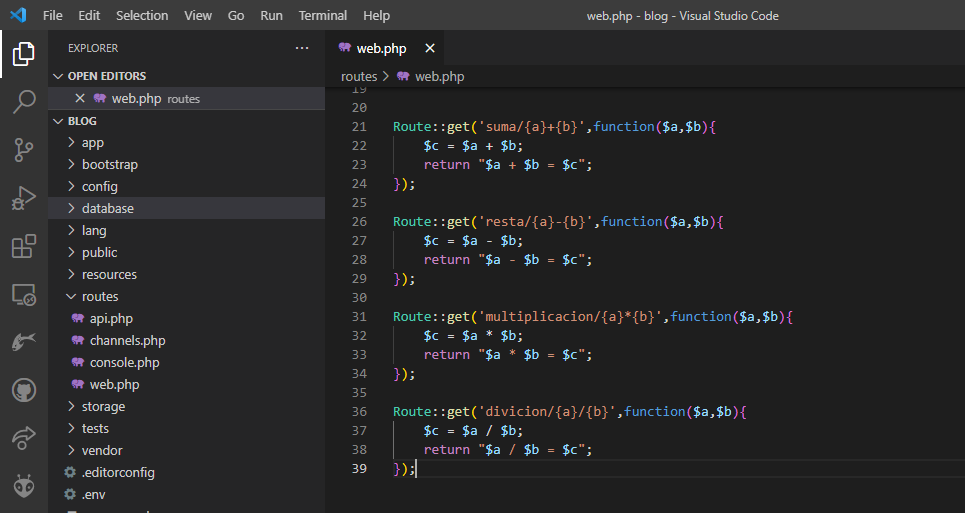

**Suma**

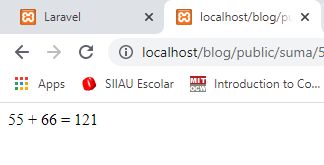

**Resta**

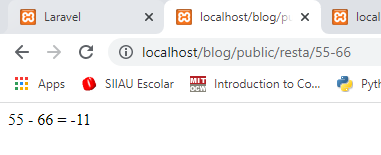

**Multiplicación**

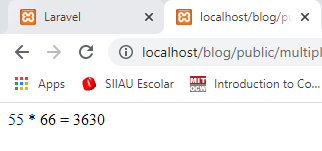

**División**

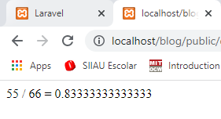

La forma correcta de hacer esto es usando controladores, podemos crear controladores de manera sencilla desde la ventana de comandos
con la instrucción 'php artisan make:controller BasicMathController'

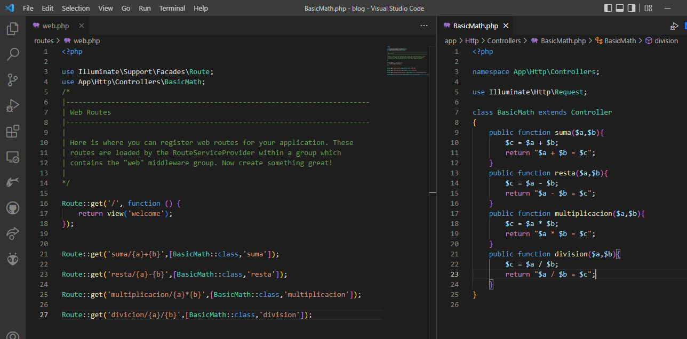

Esto puede simplificarse usando la función group

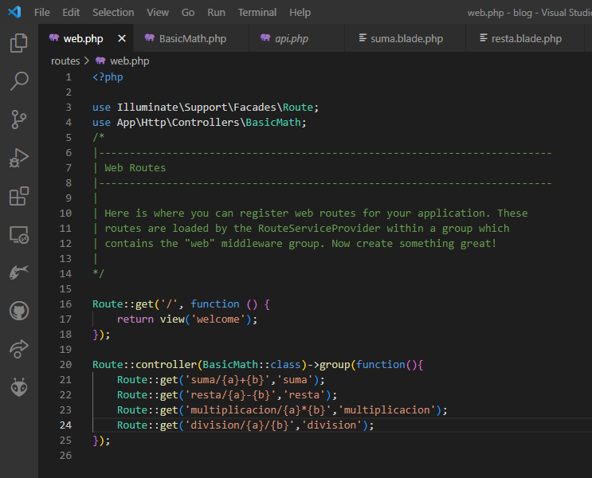
